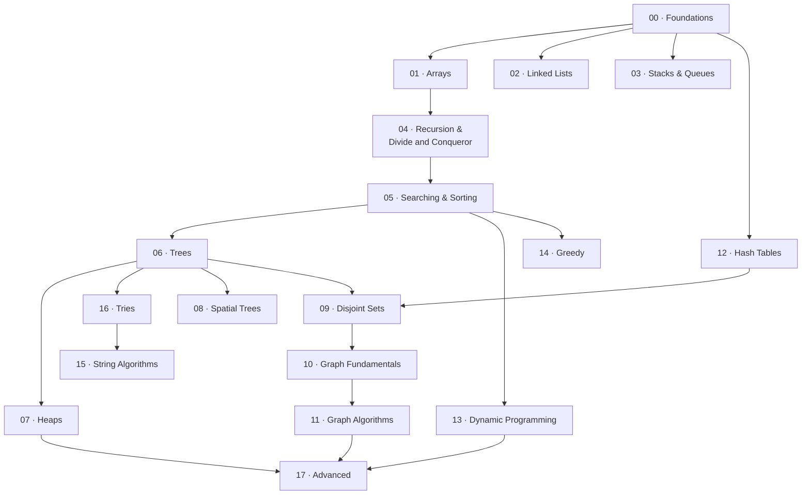

# Introduction

A hands-on **workbook** for mastering data structures and algorithms from first
principles. Each topic is a fill-in-yourself lecture page (concept → complexity →
implementation walkthrough) paired with a Java skeleton, JUnit 5 tests, and a
problem set. Everything ships **blank**: you implement the skeletons until the
tests pass and grind the problems until the patterns are automatic.

## 🗺️ Roadmap

Work the modules in this order — each phase assumes the vocabulary of the ones
above it. Inside a phase, order is flexible.

### The path

| Phase | Modules | What you learn | What it unlocks |
|---|---|---|---|
| **0 · Foundations** | `00` | Big-O, recurrences, amortized analysis | The language to reason about *every* later structure: don't skip it |
| **1 · Linear structures** | `01` Arrays · `02` Linked Lists · `03` Stacks & Queues · `12` Hash Tables | contiguous vs linked memory, LIFO/FIFO, O(1) hashing, prefix sums, monotonic stack | the containers every algorithm is built on *(pull Hash Tables forward: it's used everywhere)* |
| **2 · Recursion & Order** | `04` Recursion / Divide and Conqueror · `05` Searching and Sorting | recursion/backtracking, divide-and-conquer, the comparison sorts, binary search (incl. on the answer), quickselect | recursive thinking + the sort/search toolkit trees, graphs, and DP all lean on |
| **3 · Hierarchical** | `06` Trees · `07` Heaps · `16` Tries · `08` Spatial Trees | BSTs and Balance (i.e. AVL/RB/B-tree), priority queues, prefix trees, k-d/quad trees | logarithmic ordered / priority / prefix queries |
| **4 · Graphs** | `09` Disjoint Sets · `10` Graph Fundamentals · `11` Graph Algorithms | union-find, BFS/DFS/topo/SCC, Dijkstra/Bellman-Ford/Floyd-Warshall, MST, max-flow/min-cut | modeling the huge class of problems that are secretly graphs |
| **5 · Paradigms** | `13` Dynamic Programming · `14` Greedy | state/transition design, the classic DPs, exchange-argument greedy | optimization problems — the hardest, most rewarding tier |
| **6 · Strings** | `15` String Algorithms | KMP, Rabin–Karp, Z-algorithm | linear-time pattern matching (pairs with Tries from Phase 3) |
| **7 · Advanced** | `17` | segment/Fenwick trees, lazy propagation, sparse tables, suffix arrays/trees, treaps, vEB | competitive-programming range-query power — a capstone |

### How to work a module / topic

Best done **with an AI coding agent as a tutor** — see [Learning with AI](learning-with-ai.md) for the full setup. Per topic:

1. **Learn** it section by section — `/teach <topic>` (or "teach me `<topic>`"). The agent teaches one section, then stops until you understand it and have written that section's notes in your own words.
2. **Implement** the `code/` skeleton until the `tests/concepts` tests go green.
3. **Grind** the problem set — **Foundational** first (write them cold), then **Applied** (recognize the pattern, no peeking). They self-grade via tests, and LeetCode ones link out.
4. **Drill more** when you want extra reps — `/extra-practice <module>` generates fresh problems + stubs + tests in the same format.

The agent never hands over answers — it teaches, grades, and drills; you write every note, skeleton, and solution.

### Pacing and Checkpoints

- ~1 module/week solo. Don't advance until the **Foundational** problems are automatic; re-do a few old **Applied** ones weekly so earlier patterns stay sharp.
- **After Phase 2** → most easy/medium array & sorting problems are comfortable.
- **After Phase 4** → you can model and solve graph problems (a major interview gate).
- **After Phase 5** → DP isn't scary; you derive recurrences yourself.
- **After Phase 7** → ready for competitive programming and the hardest interviews.
